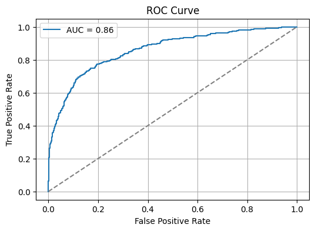
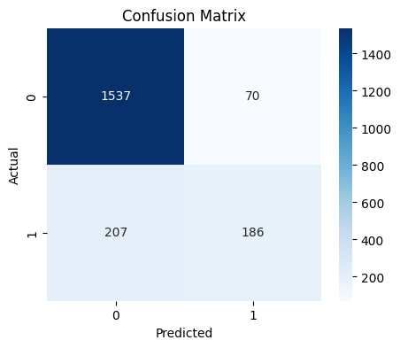

# 🧠 ANN-CHURN – Customer Churn Prediction using Artificial Neural Networks (ANN)

This project is an interactive AI-powered web application that predicts whether a customer is likely to churn based on behavioral and financial attributes.

---

## 🚀 Live Demo

🔗 [Streamlit App](https://ann-churn-rmayank.streamlit.app/)  
🔗 [GitHub Repository](https://github.com/rmayank-24/ANN-CHURN)

---

## 🛠️ Tech Stack

| Component        | Library/Tool                     |
|------------------|----------------------------------|
| Model            | TensorFlow / Keras ANN           |
| Preprocessing    | Scikit-learn (StandardScaler, LabelEncoder, OneHotEncoder) |
| Deployment       | Streamlit                        |
| Explainability   | SHAP (KernelExplainer)           |
| Visualization    | Seaborn, Matplotlib              |
| Persistence      | Pickle for loading encoders      |

---

## 🔍 Features

- Predicts churn likelihood using a trained **ANN model**.
- Trained on the **Churn_Modelling.csv** dataset.
- User-friendly UI for customer attribute inputs:
  - 🌍 Geography, ⚧ Gender, 🎂 Age, 💳 Credit Score  
  - 💰 Balance, 💼 Salary, ⌛ Tenure, 🛍️ Products  
  - ✅ Active Member, 💳 Credit Card Ownership
- Real-time prediction with **churn probability** score.
- SHAP Explainability to interpret model predictions.
- Model comparison with **Logistic Regression** and **Random Forest**.
- Hyperparameter tuning using `GridSearchCV`.

---

## 📊 Model Evaluation

| Model              | Accuracy | Precision | Recall | F1 Score | ROC AUC |
|-------------------|----------|-----------|--------|----------|---------|
| **ANN (Final)**    | 0.86     | 0.71      | 0.47   | 0.56     | 0.86    |
| Logistic Regression | 0.81   | 0.55      | 0.20   | 0.29     | 0.78    |
| Random Forest       | 0.87   | 0.76      | 0.47   | 0.58     | 0.86    |

---

## 📈 Visual Insights

### 🎯 Target Variable Distribution
Shows imbalance between churned and retained customers.  


### 📉 ROC Curve
Visualizes model's true vs false positive rate.  


### 💡 SHAP Summary Plot
Interprets model predictions with feature impact.  
.png)

### 📌 Confusion Matrix
Displays TP, TN, FP, FN for classification accuracy.  


---

## 📁 Project Structure

```
.
├── app.py                      # Streamlit app for live predictions
├── model.h5                    # Trained ANN model
├── scaler.pkl                  # StandardScaler object
├── label_encode_gender.pkl     # LabelEncoder for gender
├── onehot_geo.pkl              # OneHotEncoder for geography
├── Churn_Modelling.csv         # Dataset used for training
├── experiments.ipynb           # Model training and evaluation
├── prediction.ipynb            # Final testing and inference
├── hyperparametertuning.ipynb  # GridSearchCV tuning notebook
├── images/
│   ├── target_distribution.png
│   ├── roc_curve.png
│   ├── shap_summary.png
│   └── confusion_matrix.png
├── requirements.txt
└── README.md
```

---

## 💻 Installation

```bash
git clone https://github.com/rmayank-24/ANN-CHURN
cd ANN-CHURN
pip install -r requirements.txt
streamlit run app.py
```

---

## 📌 Author

**Mayank Rathi**  


